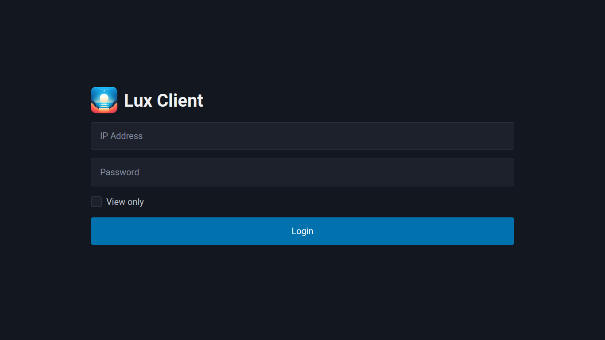

# Lux

Lux is a video streaming client. Lux can connect to [Tenebra](https://github.com/UE2020/tenebra) to control another machine. Lux supports mouse, touch, and stylus input.

## Usage

Lux is a simple static site, and only requires a tool like [shost](https://github.com/BlueCannonBall/shost) to host.

## Screenshot

