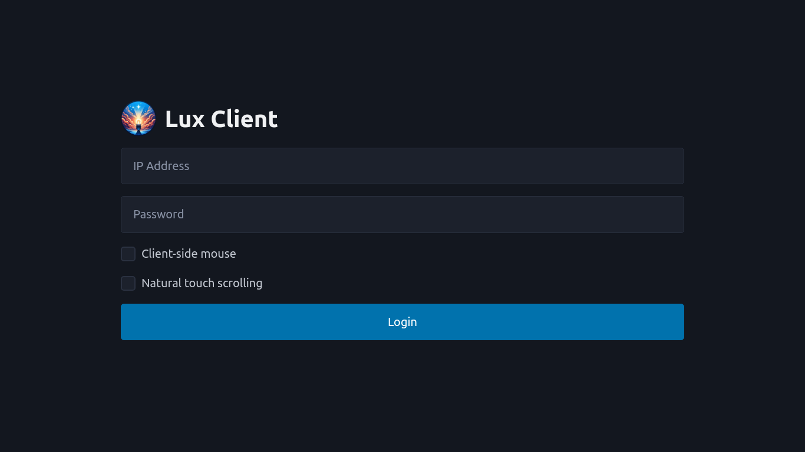

# Lux

> *"Vos estis **lux** mundi. Non potest civitas abscondi supra montem posita;"*

> *"You are the **light** of the world. It is impossible to hide a city on a hill;"*

Book of Matthew 5:13

Lux is a web-based remote desktop client. Lux can connect to [Tenebra](https://github.com/UE2020/tenebra) to control another machine. Lux supports mouse, touch, and stylus input.

## Usage

Lux is a simple static site, and only requires a tool like [shost](https://github.com/BlueCannonBall/shost) to host.

## Screenshot

